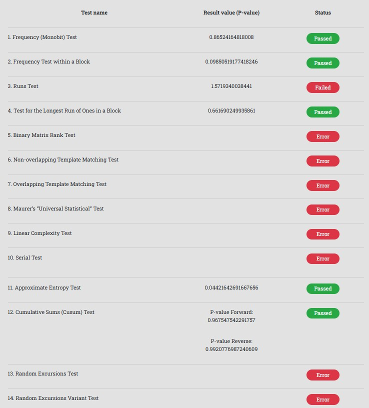

# Relatório - Prática 07: Blum Blum Shub

**Aluno:** Daniel Thielmann  
**Disciplina:** DCC075 – Segurança em Sistemas de Computação  
**Professor:** Edelberto Franco Silva  
**Data de Entrega:** 17/06/2025

---

## Objetivo

Implementar o algoritmo de geração de números pseudoaleatórios **Blum Blum Shub (BBS)** para gerar uma sequência de 20.000 bits
e analisá-la utilizando a ferramenta online baseada na suíte NIST:  
🔗 https://mzsoltmolnar.github.io/random-bitstream-tester/

---

## Implementação

O algoritmo foi implementado em Python, com geração e validação dos números primos `p` e `q`, ambos **maiores que 10.000** e congruentes a `3 mod 4`.  
A semente `s` foi escolhida de forma que fosse **coprima com n = p × q**. A sequência binária gerada foi salva no arquivo `saida_bbs.txt`.

### Requisitos atendidos:

- `p = 13687` e `q = 19447` (ambos primos e ≡ 3 mod 4).
- `s = 240750636`, válido e coprimo com `n = 266114089`.
- 20.000 bits gerados e salvos corretamente no formato compatível com o site da suíte NIST.

---

## Execução

1. O script `blum_blum_shub.py` foi executado com Python.
2. A sequência binária foi salva no arquivo `saida_bbs.txt`.
3. O arquivo foi carregado no site: [Random Bitstream Tester](https://mzsoltmolnar.github.io/random-bitstream-tester/)
4. Os testes estatísticos foram executados.
5. O print dos resultados foi capturado e incluído abaixo.

---

## Resultados da Análise

---

## Conclusão

O gerador Blum Blum Shub apresentou resultados esperados:  
Os testes básicos como **Monobit**, **Entropia Aproximada** e **Cumulative Sums** foram **aprovados**, indicando boa distribuição e compressibilidade.

Outros testes mais específicos falharam (como **Runs**, **Template Matching** e **Complexidade Linear**), o que pode estar relacionado ao padrão matemático do algoritmo ou à limitação do tamanho da amostra.

Mesmo assim, os resultados são compatíveis com o propósito didático da atividade e demonstram a viabilidade do BBS como um gerador pseudoaleatório seguro.

---

**Pasta do projeto**: `07-BlumBlumShub/`  
**Arquivo gerado para teste**: `saida_bbs.txt`
